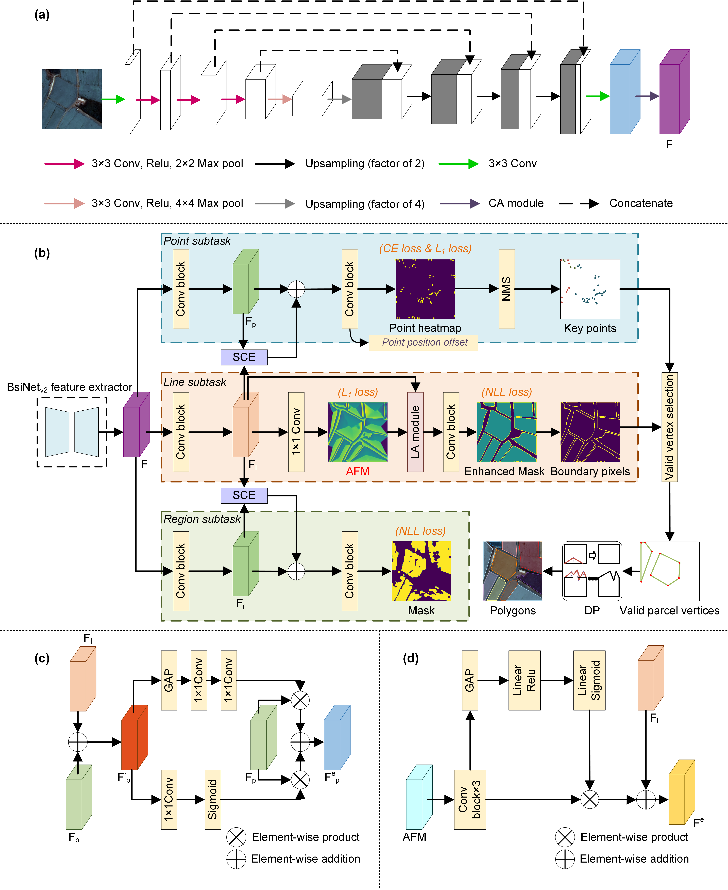

# PLR-Net_torch_version
Official Pytorch Code base for "Extracting vectorized agricultural parcels from high-resolution satellite images using a Point-Line-Region interactive multi-task model".
### More details regarding the codes will be available after the paper is accepted.
### You can always contact us by mli@fzu.edu.cn.

  

# Training & Testing

  The structure of the data file should be like:
  
    /data 
    |-- data
    
        |-- train
        |   |-- images
        |   |-- annotation.json
  
        |-- val
        |   |-- images
        |   |-- annotation.json

      
  Training
  
  Single GPU training
  
    python scripts/train.py --config-file config-files/PLR-Net.yaml
  
  Testing
    
    python scripts/test.py --config-file config-files/PLR-Net.yaml

# GF-2 dataset
Xinjiang dataset: https://pan.baidu.com/s/16h4mlkxFfaOuX1HRDPholQ, password：hql4

Shandong dataset: https://drive.google.com/drive/folders/1s1S4KhW33eo9ylsIqfUskNXl3XLBSADL?usp=sharing

Sichuan dataset:  https://drive.google.com/drive/folders/1GxGSerKCtoge-uIq1Rfec0GwSkw0CvQn?usp=sharing
